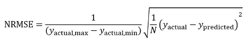

# COVID-19 Case Rate Prediction Project
CS 7641, Group 16

Stephen Allegri, Sarah Bi, Shuvo Newaz, Marcia Schulman, Armon Varmeziar 

## Introduction/Background
The CDC confirmed the first case of COVID-19 in the United States on January 21st, 2020. Since then, various state governments have been taking a multitude of approaches to mitigate the consequences of this pandemic. A plethora of data has been published regarding each state’s pandemic statistics over the past year. Our group plans to leverage this data, with a variety of machine learning methods, to see which approaches have been most effective in reducing the COVID-19 case rate and unearth the features that have played the biggest role. We hope to use this data to help states understand what factors are important in combatting COVID-19. For example, we may find that the healthcare quality of a state can greatly impact the number of people who are infected while state-at-home orders do not greatly reduce the number of COVID-19 cases. In this case, a state can use this information to focus its resources on factors that do play a significant role in reducing case rate. 

## Problem Definition
Understanding which preventative measures are effective or ineffective— and to what degree they are such— in fighting COVID-19 is important when the costs can be so high. Is staying home worth the economic hit? How important are co-morbidities? What role do demographics play? Is getting vaccinated effective? These are questions that require specific models, and therefore data, to answer. The problem we aim to address is: how impactful is each feature (vaccination distribution, age, demographic status, health status, etc.) when attempting to predict the COVID-19 case rate? 

## Data Collection
### Finding Data

Our main objective was to determine which features are most important when trying to predict COVID-19 case rates. Additionally, we want to know how import. We started off searching for pertinent, reliable datasets that consisted of all the information we were looking for. We operated on the assumption that if a dataset had the information we were looking for, there are cleaning techniques to make it usable. The information we wanted included date data (by day) to track how COVID-19 changes on a temporal level; demographic, geographic, general health, and population data to see which features have an impact; and, finally, vaccine data, to track just how effective the dose rollout has been. With these target features, we tried to make the scope as specific as possible. In this case, it would come down to a county-level depth for all the information we were looking for. This presented our first major problem— vaccine data is still relatively new and volatile and is mostly controlled on a state-wide basis. Thus we had a dataset-joining issue. Having a single dataset to work with would no longer be feasible, as a state-only scope would present too little data on which to train and test certain models. This problem required a cleaning fix, which will be discussed in the next section. 

### Cleaning Data
Given the scope problem, we decided it would be best to split the data into two aggregated datasets, with Dataset 1 working on the state level and Dataset 2 working on the county level. Dataset 1 (cases_deaths_vaccines_cleaned.csv) would include all cases, deaths, dates, and vaccine information, while Dataset 2 (state_county_info_cleaned.csv) would include all cases, deaths, dates, and any features measurable on the county scale (mostly demographic and health-adjacent features). Both of these datasets were derived from reliable data sources. Dataset 1 is comprised of three datasheets— two from the CDC and one for state abbreviations. Dataset 2 is comprised of many different datasets from many different domains, joined into a large master dataset stored on Kaggle. The cleaned vaccine dataset (Dataset 1) included data from 2021-01-13 to 2021-03-28, resulting in a dataframe size of around 1678 rows and 28 columns. The cleaned county features dataset (Dataset 2) included data from 2020-03-24 to 2020-12-04, and resulted in a dataframe size of around 601,156 rows and 39 columns. As a short aside, none of the dates in these two datasets overlap, meaning that vaccine information should have no impact on the results derived from Dataset 1 (and vice versa). 

Once the two datasets were split, the preliminary feature cleaning was done. This was performed before any algorithmic feature selection tools were implemented. The original joined dataset containing all the county information had around 200 features, which we reduced to around 40 based on what we were explicitly looking for. Figure 1, seen below, shows a list of all the features we decided to keep in this dataset (Dataset 2). Dataset 1 also had some preliminary feature reduction, though not as robust as Dataset 2. The features kept for Dataset 1 can also be seen below (Figure 2). Beyond this preliminary feature reduction, we performed some final cleaning, such as changing data types and formatting dates, strings, names. This was done mostly for joining purposes. Finally, we did some feature engineering to help smooth everything out once the algorithms finally came into play. Due to a lack of categorical data, we created features like above_daily_mean and above_daily_median which measure whether or not normalized COVID-19 case rates (cases per population) were above or below the respective daily mean or median. These categorical features, normalized by population to better capture non-population related effects, would eventually allow for some extremely insightful findings, especially regarding Dataset 2. This feature engineering allowed for the implementation of algorit such as logistic regression, decision tree and random forest classifiers, and even multi-level Perceptron neural network classifiers.

All of this cleaning was originally going to be done using SQL, but after some consideration, utilizing the Python Pandas library seemed more intuitive considering its close ties with many of the ML libraries, especially scikit-learn. SQL is fast, but for our purposes, with some vectorization and apply() methodologies, Pandas was more than good enough. The slight speed tradeoff was nothing compared to the convenience of using Pandas. Cleaning Dataset 1 was done in around 100 lines of code with a 5-10 second runtime, while cleaning Dataset 2 was done in around 150 lines of code at a one minute runtime. 

Figure 1: The above image shows the list of features we decided to keep in dataset 2 (the county features set).

Figure 2: The above image shows the list of features we decided to keep in dataset 1 (the vaccine features set).

## Methods 
### Supervised Learning Component
The supervised learning component included using various algorithms to predict the number of COVID-19 cases each state has. Based on a literature review of previous machine learning studies regarding COVID-19, we have decided to test the following 4 algorithms to determine which yields the best results: linear regression, logistic regression, decision tree and random forest, and neural network [1]-[3]. The feature data includes demographic information about each state as well as COVID-19 vaccination information. The label data is the actual number of cases that each state has recorded thus far. The demographic data was obtained from a publicly available dataset on Kaggle [4], while the vaccination and case rate data were obtained from published CDC statistics [5][6].

### Unsupervised Learning Component
The unsupervised learning component of the project used principal component analysis (PCA) for dimensionality reduction to determine which of the features have the greatest significance in case rate prediction. We performed PCA on both datasets and produced a scree plot to determine which principal components capture the most amount of variance in the reconstructed dataset. 

## Results 
### Linear Regression 

Using regression analysis, we can predict the number of cases in some counties (test data), given the number of cases in other counties (training data). Since the features (e.g., population density, income ratio, life expectancy, etc.) have different values in different counties, our goal is to recognize whether the features we have in our dataset have any influence on the number of COVID cases.

The dataset has data from about 2400 counties from all 50 states, starting on March 24, 2020 and ending on December 4, 2020. A day was chosen at random between May 1, 2020 to December 4, 2020. This is done because not a lot of data is available from the first trimester of 2020, and doing analysis on one of those days will suffer from insufficient training. Ninety-five percent of the data points from the selected day are chosen for training and the rest are put aside for testing. The training data is further split into a pure training set (75% of total data points) and a validation set (20% of total data points). A regression model was fit to the pure training data set and tested on the validation set. The degree of 1-5 is used for regression. The degree that yielded the least mean-squared error on the validation set was chosen to fit the regression model of the original, larger training data. After fitting, the model was tested on the test data.

The above procedure is applied on 3 datasets:

   i. The set with all the features intact.
        
   ii. The set obtained after feature reduction using Backward Elimination (based on p values)
    
   iii. The set obtained after feature reduction using Forward Selection (based on p values)

The following results were obtained when trained and tested on the data from a random day using ridge regression:

Figure 3: Linear regression results from October 12, 2020.

Figure 4: Linear regression results from September 6, 2020.
 
Note: The mean-squared error shown is not normalized.

Judging by the trend of the true and predicted values, it is safe to assume that the feature set has some influence on the number of cases in a county. There are anomalies in the results (e.g., number of cases is negative), probably because the feature set that we are using is missing some very important attributes. For example, a good overall sense of hygiene within a county may be effective in reducing the number of cases even if the population density is relatively high. The error obtained after feature reduction is usually lower than that obtained before feature reduction.

We explored other forms of regression to check for any improvements. For example, a neural network-based regression may reduce the mean-squared error. Therefore, we also experimented with different regularization techniques (Tikhonov, LASSO) to see how different regularization impacts the final prediction.

In addition to the regression techniques described above, we did the following types of regression:

   i. Linear Regression on dataset with all the features
      
   ii. Lasso Regression on dataset with all the features
      
   iii. Linear Regression on dataset after Backward Elimination
      
   iv. Linear Regression on dataset after Forward Selection
      
   v. Linear and Ridge Regression on dataset after PCA
      
   vi. Linear and Ridge Regression on dataset after Multidimensional Scaling (MDS)
      
   vii. CNN based Regression on dataset with all the features
      
   viii. CNN based Regression on dataset after Backward Elimination
      
   ix. CNN based Regression on dataset after Forward Selection
      
   x. CNN based Regression on dataset after PCA
      
   xi. CNN based Regression on dataset after MDS
      
The performance metric used was the normalized root mean-squared error, which is calculated as follows:

Figure 5: Equation used for calculating normalized root mean-squared error. 

The results obtained when regression was performed on a data from July 16, 2020 are shown below. The degree of regression was selected by 10-fold cross-validation. The degree which yielded the least cross-validation error on the training set was used to fit the training data. In addition to the regression plots, we have provided a scatter plot of Predicted vs True number of cases for each of the methods employed. This scatter plot should have a gradient of 1, ideally. However, because of imperfections in the dataset, that is not the case.

#### Linear, Ridge and Lasso regression on Full Dataset

On the original dataset containing all the features, the type of regression (Linear, Ridge, Lasso) didn’t make much of a difference. A difference, either in the form of improvement or deterioration, was observed only after we manipulated the data by feature selection/reduction techniques.

Figure 6: Linear regression results on full dataset. 

Figure 7: Ridge regression results on full dataset. 

Figure 8: Lasso regression results on full dataset. 

#### Linear and Ridge Regression after Backward Elimination

The regression after backward elimination or forward selection usually yields a lower NRMSE than the regression on the entire feature set.

Figure 9: Linear regression results on full dataset after backward elimination. 

Figure 10: Ridge regression results on full dataset after backward elimination. 

#### Linear and Ridge Regression after Forward Selection

Figure 11: Linear regression results on full dataset after forward selection. 

Figure 12: Ridge regression results on full dataset after forward selection. 

#### Linear and Ridge Regression after PCA

For PCA, the data was reconstructed using the number of components that retains 90% of the total variance. The results obtained are not very promising.

Figure 13: Linear regression results on reconstructed dataset obtained from PCA. 

Figure 13: Ridge regression results on reconstructed dataset obtained from PCA. 

#### Linear and Ridge Regression after MDS

The number of components used for MDS was 4. This number is arbitrary, and we may experiment with different number of components to see how the results change with it. The MDS-reduced dataset performs the worst with the traditional regression approaches.

Figure 14: Linear regression results after MDS. 

Figure 15: Ridge regression results after MDS. 

### CNN Regression

The CNN architecture used for regression is shown below. Adam optimizer was used.

Figure 16: CNN architecture used for regression. 

The results obtained by using this architecture are shown below. While this architecture gives some decent results, it is possible that using some other architecture could have yielded better results, shown in the figures below. Experimenting with different CNN architectures may be a possible extension of this project. The CNN based regression displays a drastic improvement with MDS-reduced dataset. A comparison of the different regression techniques is shown in Figure 21.

Figure 17: CNN-based regression on full dataset. 

Figure 18: CNN-based regression after backward elimination. 

Figure 19: CNN-based regression after forward selection. 

Figure 20: CNN-based regression after PCA. 

Figure 21: CNN-based regression after MDS. 

Figure 22: Comparison of different regression techniques. 

### Logistic Regression

Our datasets are inherently continuous, but we decided to add a classification component to our analysis in order to explore the data and utilize some additional ML models. This classification was done on the metrics above_daily_mean and above_daily_median, which both result in either 0 or 1 based on whether or not the proportion of the population with COVID-19 (cases per population of respective datapoint) is higher than the daily average or median of all the datapoints' population proportions with COVID-19. Using this new discrete classifier, we implemented a logistic regression model using scikit-learn. The data was split on a 80-20 basis, with 80% of the data used in training. The loogistic regression solver used was the Broyden–Fletcher–Goldfarb–Shanno algorithm with a maximum of 10000 iterations.

Before training the model, some feature pruning was required. Features that were used to engineer above_daily_mean and above_daily_median were obviously removed from training, along with some other features that would have led to extremely biased predicions (cases, death, etc.). With the removal of these features, we were able to train two logistic regression models on Dataset 2, the first of which used raw input data, the second of which used standardized data. The first model resulted in accuracies of 72% and 71 % (for above daily mean and median, respectively), and the second model resulted in accuracies of 76% and 73% (also for above daily mean and median, respectively). Interestingly, the model using the standardized data had a higher accuracy and some rather interesting coefficients (which will be explored in the next paragraph), though the basis for which standardization was necessary is still a bit vague. Standardization requires that data follow a somewhat Gaussian distribution, which we anticipated our data should. However, it's still not completely confirmed. Either way, with standardization, the classification accuracy was higher. 

Crude feature selection was also a possibility with logistic regression. The coefficients provided by the algorithm can be used to see what features have an impact on log(odds ratios). The coefficients act as a slope, a change to see how the addition of a feature changes the log(odds ratio). This value is inherently difficult to conceptualize, but converting log(odds ratio) to just odds ratio makes things a bit more clear. Figures 5, 6, and 7 below show the coefficients of the logistic regression models and the odds ratio of the standardized logistic regression model, respectively. It is easy to see what features made an impact, as shown in Figure 7. 

Figure 23: Logistic regression coefficients for all selected features for non-standardized data.

Figure 24: Logistic regression coefficients for all selected features for standardized data.

Figure 25: Odds ratios for all selected features for standardized data.

### Decision Tree and Random Forest Classification

Using the same classifiers as stated above (above_daily_mean and above_daily_median) decision tree and random forest classification models were trained on selected data from Dataset 2. Both of these models had the same base hyperparameters as set by sklearn and some cross validation was performed with no real improvement. The results both proved quite successful. The decision tree classifier had 84% accuracy in predicting above_daily mean and 82% accuracy in predicting above_daily_median. The random forest classifier had 83% accuracy in predicting above_daily mean and 82% accuracy in predicting above_daily_median. The feature importances were also obtained. Figures showing weighted feature importance for both classifiers can be seen below (Figure 26 for decision tree, Figure 27 for random forest). Interestingly, the most important features in both plots seem to be percent_black and percent_not_proficient_in_english. Percent_non_hispanic_white, percent_uninsured, and percent_65_and_over are also notable features.

Figure 26: Decision tree feature importance for above_daily_mean and above_daily_median on Dataset 2.

Figure 27: Random forest feature imortance for above_daily_mean and above_daily_median on Dataset 2.

The same models and classifiers as above were used on the Dataset 1 data (the vaccine data). The decision tree classifier had 80% accuracy in predicting above_daily mean and 78% accuracy in predicting above_daily_median. The random forest classifier had 88% accuracy in predicting above_daily mean and 88% accuracy in predicting above_daily_median. The features importances can be seen below in Figures 28 and 29 respectively. Interestingly, daily_vaccinations and share_doses_used were the most important features in both models. 

Figure 28: Decision tree feature importance for above_daily_mean and above_daily_median on Dataset 1.

Figure 29: Random Forest feature importance for above_daily_mean and above_daily_median on Dataset 1.

### Random Forest Regression

In addition to random forest classification, we ran a random forest regression model (with base hyperparameters) to predict cases_population_proportion. This feature normalizes cases by population and is a better metric for state and county comparisons. The feature list had to be reduced for both datasets to eliminate any metrics used to derive the engineered feature. Once the model ran on both datasets, the MSE for Dataset 2 was 0.0140 while the MSE for Dataset 1 was 0.0145. Given the cases_population_proportion range, this MSE is quite decent. Figures 30 and 31  some incrementally chosen datapoints for Datasets 2 and 1 (respectively) with their test and predicted values, along with a difference line. 

Figure 30: Random forest regression for Dataset 2 using 120 sequentially selected datapoints.

Figure 31: Random forest regression for Dataset 1 using 100 sequentially selected datapoints.

### Neural Network Classification

Finally, the neural network classifier provided by sklearn was used to  make classifications utilizing Dataset 2 for the features above_daily_mean and above_daily_median. This classifier, the multi-level perceptron classifier (MLP classifier), had the standard hyperparameters sans random_state and max_iterations, which were set to 1 and 300 respectively. Additionally, a pipeline was created, and a standard scaler, as provided in sklearn (with base set arguments), was fed into it alongside the MLP classifier. The classification accuracy for above_daily_mean was 83% and the accuracy for above_daily_median was 82%, both higher than anticipated.

### Principal Component Analysis
We performed dimensionality reduction using PCA on the vaccine/cases/deaths dataset (Dataset 1) as well as on the county demographic dataset (Dataset 2). 

For the cases/vaccines/deaths dataset (Dataset 1), we had 15 features to reduce. After performing PCA on all 15 features, we plotted a scree plot which explains the variance contributed by each principal component (Figure 32). Based on the scree plot, we chose to retain the first 3 principal components, which comprise of 91.40% of the dataset variance. We will reconstruct the original cases/vaccines/deaths dataset using these 3 principal components. 

Figure 32: The above image shows the scree plot obtained for the cases/vaccines/deaths dataset (Dataset 1). 

Next, we repeated the same process with the country demographic dataset (Dataset 2), where we had 34 features to reduce.  Based on the scree plot, we decided to retain the first 10 principal components (Fig. 33). Together, the first 10 principal components account for 77.38% of the variance. We will also reconstruct the county demographic dataset using these 10 principal components. 

Figure 33: The above image shows the scree plot obtained for the county demographic dataset (Dataset 2). 

Both reconstructed datasets will be used in linear regression. The results of linear regression using the reconstructed dataset can be compared to the results of linear regression using the original datasets. 

As we know, each principal component is a linear combination of the original features. Therefore, we decided to analyze the composition of each principal component as a means of understanding which of the original features were most important and how the original features were combined to create the principal components. For each of the principal components we decided to keep (3 for dataset 1 and 10 for dataset 2), we listed the top 4 original feautres that had the highest weight in the principal component (Figure 34). We can see that many of the original features are present multiple times in different principal components, but overall, there is variety in the way each principal component is composed. 

Figure 34: Composition of the principal components retained for each dataset. The top 4 highest weighted original features are listed for each principal componnet, along with their respective weight scores.

## Discussion and Conclusion
Based on the results of the machine learning methods we tested, random forest proved to be most useful in determining which features are most important in predicting COVID-19 case rates. The classification random forest had accuracies greater than 80% while the regression random forest had MSE values less than 0.015. Both of these are indicators of very good performance. In addition, the random forest methods were able to pick out the exact features that were important for case rate prediction- daily_vaccinations and share_doses_used. The feature important information determined by random forest classification matched closely with results obtained from logistic regression. Overall, we believe random forests can be a promising method for analyzing COVID-19 data. 

With the results of this study, we can help states determine which factors are important in reducing COVID-19 cases. With this information, we can better help states combat COVID-19. For example, we found that daily vaccinations proved to be very useful in predicting COVID-19 case rates. As a result, a state can use this information to focus its resources on vaccination and increasing doses. 

Some difficulties we faced were ensuring the validity of the data we use and, consequently, the validity of our results. Vaccination data is still relatively new and may not reflect actual vaccination rates. In addition, statewide COVID-19 data is often incomplete, and finding a single dataset with all the information we needed was difficult. As a result, we performed some data cleaning as well as merged multiple datasets together in order to achieve our purpose. Since the data came from separate sources, there is always a possiblity of error or mismatch in the data. However, in this study, we have shown that machine learning methods can be employed to study COVID-19 data and discover patterns that can greatly help control the pandemic. Future work will include analyzing new vaccine data that has been published since the start of this project. The more data we have, the easier it is to find patterns. We believe that as more data is collected on vaccination and COVID-19, our analysis and results will become more robust and accurate. 

#### Contributions
Stephen Allegri: Data Merging, Data Cleaning, analysis (random forest and logistic regression), Document and Video Editing

Sarah Bi: Principal Component Analysis

Shuvo Newaz: Regression Models

Marcia Schulman: Data Cleaning, Document and Video Editing

Armon Varmeziar: Research, Document Editing

## References
[1]	D. Goodman-Meza et al., “A machine learning algorithm to increase COVID-19 inpatient diagnostic capacity,” PLoS One, vol. 15, no. 9, p. e0239474, Sep. 2020.

[2]	C. An, H. Lim, D.-W. Kim, J. H. Chang, Y. J. Choi, and S. W. Kim, “Machine learning prediction for mortality of patients diagnosed with COVID-19: a nationwide Korean cohort study,” Sci. Rep., vol. 10, no. 1, p. 18716, Dec. 2020.

[3]	L. J. Muhammad, E. A. Algehyne, S. S. Usman, A. Ahmad, C. Chakraborty, and I. A. Mohammed, “Supervised Machine Learning Models for Prediction of COVID-19 Infection using Epidemiology Dataset,” SN Comput. Sci., vol. 2, no. 1, p. 11, Feb. 2021.

[4] Davis, J. (2020, April). US Counties: COVID19 + Weather + Socio/Health data, Version 24. Retrieved March 1, 2021 from https://www.kaggle.com/johnjdavisiv/us-counties-covid19-weather-sociohealth-data.

[5] Centers for Disease Control and Prevention. (2020, December). COVID-19 Vaccinations in the United States. Retrieved March 1, 2021 from https://covid.cdc.gov/covid-data-tracker/#vaccinations.

[6] Centers for Disease Control and Prevention. (2020, January). United States COVID-19 Cases and Deaths by State. Retrieved March 1, 2021 from https://covid.cdc.gov/covid-data-tracker/#cases_casesper100klast7days.
